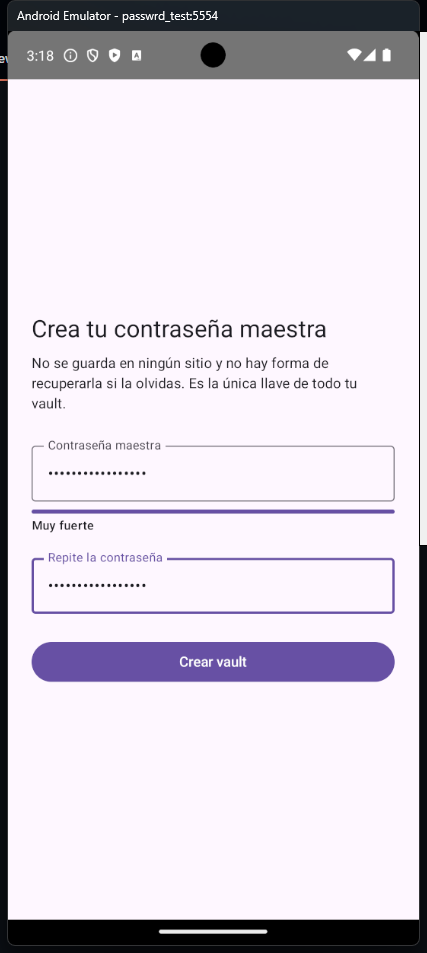
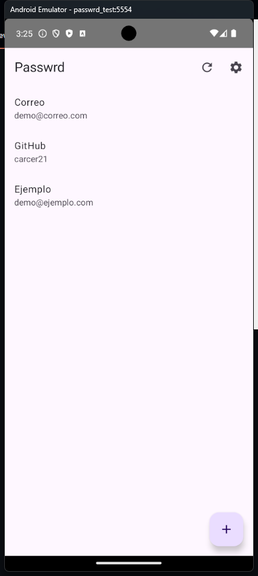
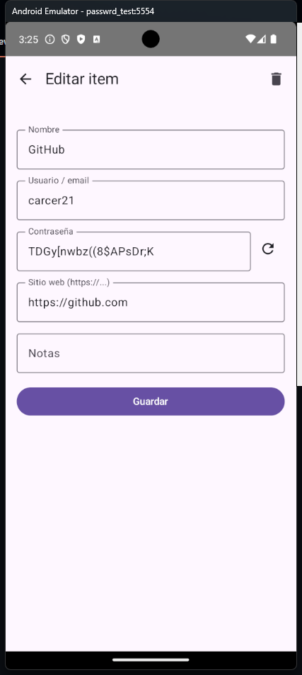
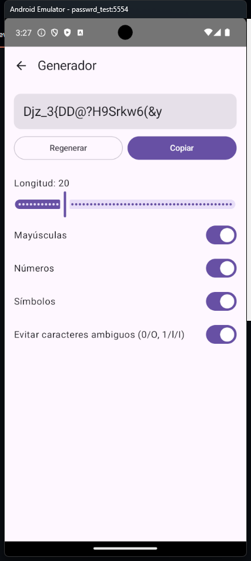
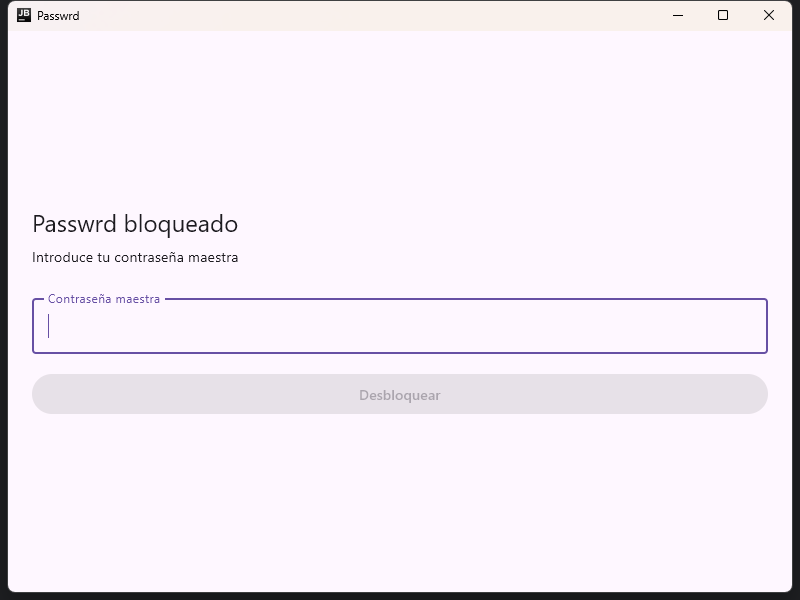

# Passwrd

[](https://github.com/carcer21/ProyectoPasswrd/actions/workflows/ci.yml)
[](LICENSE)

Gestor de contraseñas local, sin servidor y de conocimiento cero (*zero-knowledge*). Android
primero, con un núcleo criptográfico en Kotlin Multiplatform reutilizado tal cual en una app de
escritorio y una extensión de navegador.

No hay backend, no hay `INTERNET` en el manifest de Android, no hay hash verificador de la
contraseña maestra almacenado en ningún sitio. Todo el diseño criptográfico está documentado
*antes* del código en [`docs/CRYPTO_SPEC.md`](docs/CRYPTO_SPEC.md) — la premisa de partida fue que
un error en la jerarquía de claves de un gestor de contraseñas no se parchea después.

## Qué hace

- **Bóveda cifrada localmente**, desbloqueo con contraseña maestra, PIN o biometría.
- **Jerarquía de claves por item** (inspirada en Bitwarden y Proton Pass): la contraseña maestra
  nunca cifra datos directamente — deriva una clave que envuelve una Vault Key aleatoria, que a su
  vez envuelve una Item Key distinta por cada elemento guardado. AES-256-GCM de punta a punta.
- **Autofill real en Android**: `AutofillService` (API 26+) y `CredentialProviderService` (API 34+,
  con soporte de passkeys WebAuthn P-256).
- **PIN y biometría respaldados por Android Keystore** (StrongBox cuando el dispositivo lo soporta),
  nunca como raíz criptográfica alternativa — ver [ADR 0004](docs/adr/0004-pin-y-biometria-no-son-raiz-criptografica.md).
- **Export/import cifrado**, con importadores para Bitwarden, Proton Pass y CSV.
- **App de escritorio** (Compose Multiplatform / JVM) y **extensión de navegador** (MV3 +
  Kotlin/Wasm) que reutilizan el mismo núcleo `:core` sin reescribir una sola línea de cripto.

<p>
  
  
  
  
</p>


## Arquitectura

```
ProyectoPasswrd/
├─ core/            # Kotlin Multiplatform puro — cero imports de android.*
│                    # crypto, model, vault, storage, generator, matching, transfer, webauthn
├─ androidApp/       # UI Compose, autofill, credential provider, Keystore/PIN/biometría
├─ desktopApp/       # Compose Multiplatform (JVM), reutiliza :core sin cambios
├─ browserExtension/ # Manifest V3 + Kotlin/Wasm, probado en Chrome real
└─ docs/             # Spec criptográfica, modelo de amenazas, decisiones de arquitectura
```

`:core` no sabe que Android existe. Lo que necesita del sistema (aleatoriedad segura, reloj,
almacenamiento) entra por `expect`/`actual` o por interfaz inyectada — por eso el escritorio y la
extensión son módulos nuevos y no una reescritura.

## Documentación técnica

- [`docs/CRYPTO_SPEC.md`](docs/CRYPTO_SPEC.md) — jerarquía de claves, formato del blob cifrado,
  parámetros de Argon2id, rotación de claves.
- [`docs/THREAT_MODEL.md`](docs/THREAT_MODEL.md) — qué protege este diseño y qué no.
- [`docs/adr/`](docs/adr) — decisiones de arquitectura razonadas una por una (por qué AES-GCM y no
  CBC+HMAC, por qué no hay hash verificador, por qué PIN/biometría no son raíces criptográficas...).
- [`docs/PROJECT_STATUS.md`](docs/PROJECT_STATUS.md) — estado actual fase por fase y verificación
  realizada.

## Compilar y probar

```bash
export JAVA_HOME="$LOCALAPPDATA/Programs/Android Studio/jbr"   # JBR de Android Studio

./gradlew :core:jvmTest :core:testDebugUnitTest   # vectores criptográficos y round-trips
./gradlew :androidApp:assembleDebug
./gradlew :androidApp:installDebug

./gradlew :browserExtension:wasmJsBrowserDistribution   # genera dist/ cargable en chrome://extensions
```

## Estado

Fases 0–9b completas — núcleo criptográfico, app Android completa (autofill + passkeys), app de
escritorio funcional, extensión de navegador probada en Chrome real. Detalle y pendientes en
[`docs/PROJECT_STATUS.md`](docs/PROJECT_STATUS.md).

## Licencia

[MIT](LICENSE)
